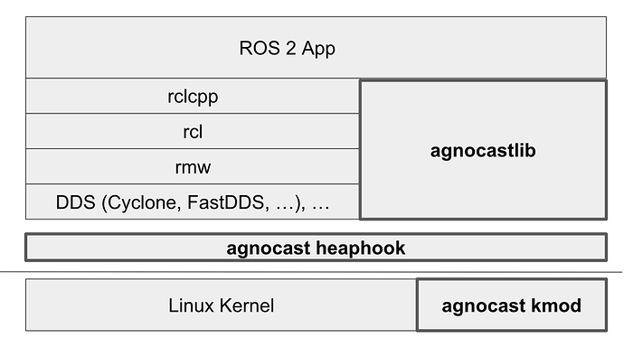
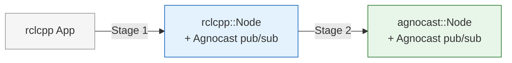

---
hide:
  - navigation
---

# Agnocast

**Agnocast is a rclcpp-compatible true zero-copy IPC middleware that supports all ROS message types, including message structs already generated by rosidl.**

ROS 2 supports a wide variety of languages, operating systems, and network transports (RMWs), making it easy to build robotics applications across diverse environments. You can first build your application with ROS 2, then, once you need more performance, gradually migrate the parts that are already working to Agnocast, step by step, and ultimately pursue the best possible performance.

Currently, **Linux (Ubuntu)** and **C++ (rclcpp)** applications are supported. Whether support for other OSes or language bindings will be added in the future is undecided.

## Key Features

- **True zero-copy IPC** — No serialization, no copies, no compromise. Agnocast delivers messages through shared memory with zero overhead, and it works with every ROS message type out of the box — including structs already generated by rosidl.
- **Drop-in migration** — Existing rclcpp applications can adopt Agnocast incrementally. A two-stage migration path lets you gain zero-copy performance immediately, then optionally bypass the rcl layer entirely for even lower latency and CPU usage.
- **Per-callback scheduling** — Assign thread priority and CPU affinity per CallbackGroup via a simple YAML file. The CallbackIsolatedExecutor gives you real-time-grade control over exactly which callbacks run where and when.
- **ROS 2 interoperability** — The Agnocast-ROS 2 Bridge lets Agnocast nodes and standard RMW-based nodes coexist in the same system. Adopt gradually — no big-bang rewrite required.

---

## Two-Stage Migration

Existing rclcpp applications can be rewritten in two stages, with performance gains at each stage.

| Stage | Node Class | What Changes | Performance Gain |
|-------|-----------|-------------|-----------------|
| **Stage 1** | `rclcpp::Node` (unchanged) | Rewrite publishers, subscriptions, and smart pointers to use Agnocast APIs | Zero-copy IPC for Agnocast topics |
| **Stage 2** | `agnocast::Node` | Replace the node base class (requires all pub/sub in the node to be Agnocast-ized) | Bypass rcl layer — reduced launch time and CPU usage |

The [Agnocast-ROS 2 Bridge](migration-guide/bridge.md) enables interoperability between Agnocast and standard ROS 2 nodes at any stage. It offers three modes — Off, Standard, and Performance — so you can start simple and optimize later.

See the [Migration Guide](migration-guide/index.md) for details and code examples.

---

## Supported Environments

| Component | Supported Versions |
|-----------|-------------------|
| ROS 2 | Humble / Jazzy (rclcpp only) |
| Linux | Ubuntu 22.04 / 24.04 |
| Kernel | 5.x / 6.x series |

Both Humble and Jazzy use Agnocast major version **2**. The major version is fixed within a ROS 2 distribution and will not change during its lifetime. See the [versioning rules](environment-setup/index.md) in Environment Setup for details.

---

## Links

- [Source Code (GitHub)](https://github.com/autowarefoundation/agnocast)
- [Design Documents (for developers)](https://github.com/autowarefoundation/agnocast/tree/main/docs)
