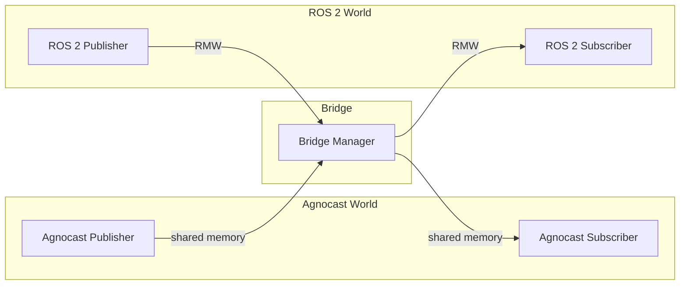
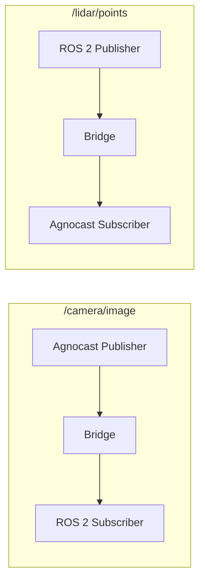
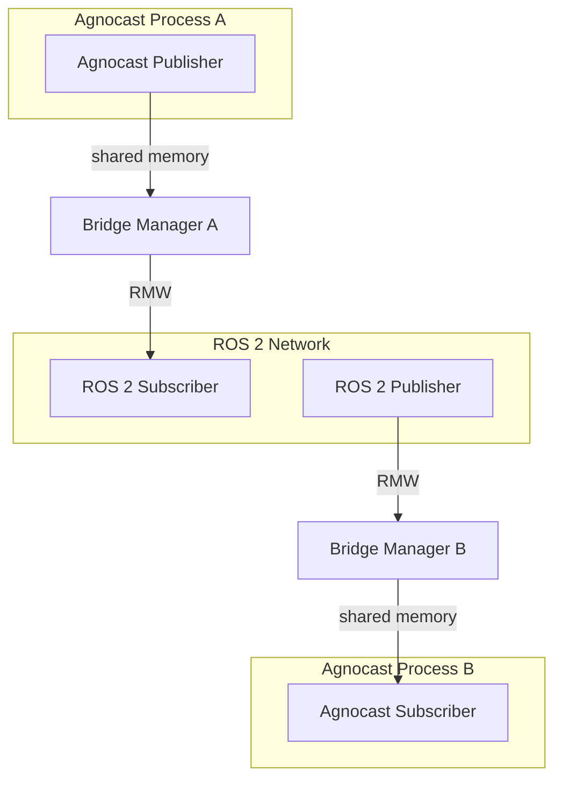
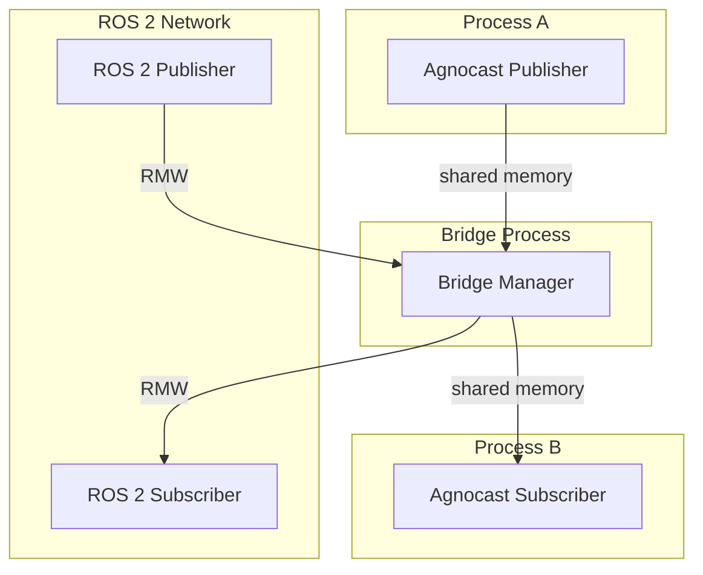

# Agnocast-ROS 2 Bridge

The Bridge enables communication between Agnocast nodes and standard ROS 2 nodes (RMW). It automatically forwards messages bidirectionally, allowing gradual migration — you don't need to migrate all nodes at once.
The Bridge can be introduced at **either Stage 1 or Stage 2**. It is independent of which node class you use.



For example, on a given topic, one side can be an Agnocast publisher while the other is a ROS 2 subscriber, or vice versa — the Bridge transparently connects them:



## Bridge Modes

The Bridge is enabled by default in Standard Mode, so the system continues to work as-is even when individual publishers or subscribers are migrated to Agnocast — no additional setup is required.
Agnocast supports three bridge modes, controlled by the `AGNOCAST_BRIDGE_MODE` environment variable:

| Mode | Value | Description |
|------|-------|-------------|
| **Off** | `0` or `off` | Bridge disabled. Agnocast and ROS 2 nodes cannot communicate. |
| **Standard** | `1` or `standard` | One bridge manager process forked per Agnocast process. **Default mode.** |
| **Performance** | `2` or `performance` | Single bridge manager process per IPC namespace. Lower overhead. |

Standard Mode forks a dedicated bridge manager process for each Agnocast process, which is simple but not resource-efficient at scale. Performance Mode forks a single bridge manager process per IPC namespace, significantly reducing overhead. It requires building a dedicated shared library for the message types you use, but this can be done with a single CLI command (`ros2 agnocast generate-bridge-plugins`).

### Choosing a Mode

| Consideration | Standard | Performance |
|--------------|----------|-------------|
| Setup complexity | None (works out of the box) | Requires plugin generation and build |
| Resource usage | Higher (one bridge per process) | Lower (single bridge per IPC namespace) |
| Process isolation | High (bridge failure affects only one process) | Low (single point of failure) |
| Topic support | All ROS message types | Only pre-compiled message types |
| Bridge activation | Eager (created when Agnocast pub/sub is created) | Lazy (created when both Agnocast and ROS 2 endpoints exist) |

For most use cases, start with **Standard Mode**. Switch to **Performance Mode** when you need to optimize resource usage in production.

## Configuration

### Setting the Bridge Mode

**In launch files (XML):**

```xml
<node pkg="your_package" exec="your_node" name="your_node" output="screen">
    <env name="LD_PRELOAD" value="libagnocast_heaphook.so:$(env LD_PRELOAD '')" />
    <env name="AGNOCAST_BRIDGE_MODE" value="standard" />
</node>
```

**As an environment variable:**

```bash
export AGNOCAST_BRIDGE_MODE=standard  # or "performance" or "off"
```

### Disabling the Bridge

If all your nodes use Agnocast and you don't need RMW interoperability:

```xml
<env name="AGNOCAST_BRIDGE_MODE" value="off" />
```

## Standard Mode

Standard Mode is the default. Each Agnocast process forks a dedicated bridge manager process. No additional configuration is needed beyond `LD_PRELOAD`.



## Performance Mode

Performance Mode uses a single bridge manager process per IPC namespace. It reduces resource overhead but requires pre-compiled bridge plugins.



### Setup

**Step 1:** Generate bridge plugins for the message types you need:

```bash
ros2 agnocast generate-bridge-plugins \
  --packages std_msgs sensor_msgs geometry_msgs

# Or for all available message types
ros2 agnocast generate-bridge-plugins --all
```

**Step 2:** Build the plugins:

```bash
colcon build --packages-select agnocast_bridge_plugins \
  --cmake-args -DCMAKE_BUILD_TYPE=Release
```

**Step 3:** Launch the bridge manager as a separate process:

```xml
<node pkg="agnocast_components" exec="agnocast_bridge_manager"
      name="agnocast_bridge_manager" output="screen">
    <env name="LD_PRELOAD" value="libagnocast_heaphook.so:$(env LD_PRELOAD '')" />
</node>
```

**Step 4:** Set all Agnocast nodes to Performance Mode:

```xml
<node pkg="your_package" exec="your_node" name="your_node" output="screen">
    <env name="LD_PRELOAD" value="libagnocast_heaphook.so:$(env LD_PRELOAD '')" />
    <env name="AGNOCAST_BRIDGE_MODE" value="performance" />
</node>
```

### Limitations

- Only message types included in the generated plugins can be bridged
- If the bridge process crashes, all Agnocast ↔ ROS 2 communication is lost
- Requires a separate build step for plugin generation

## QoS Behavior

The Bridge's QoS behavior differs by direction:

**ROS 2 → Agnocast (R2A):**
The Bridge's internal ROS 2 subscription inherits the QoS settings from the external Agnocast subscriber.

**Agnocast → ROS 2 (A2R):**
The Bridge's internal ROS 2 publisher uses fixed QoS:

- Depth: 10
- Reliability: Reliable
- Durability: TransientLocal

## Known Limitations

- Cross-IPC Namespace Bridge (Unsupported as of v2.3.3)
  - Communication between Agnocast nodes and ROS 2 nodes across different IPC namespaces is not currently supported. The Bridge only operates within the same IPC namespace. Cross-IPC namespace bridging is planned for a future release.
