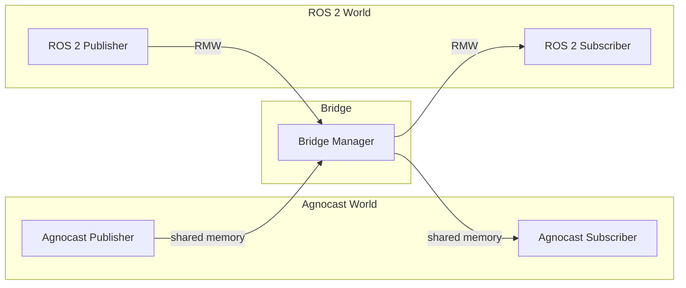
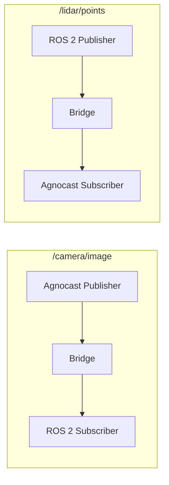
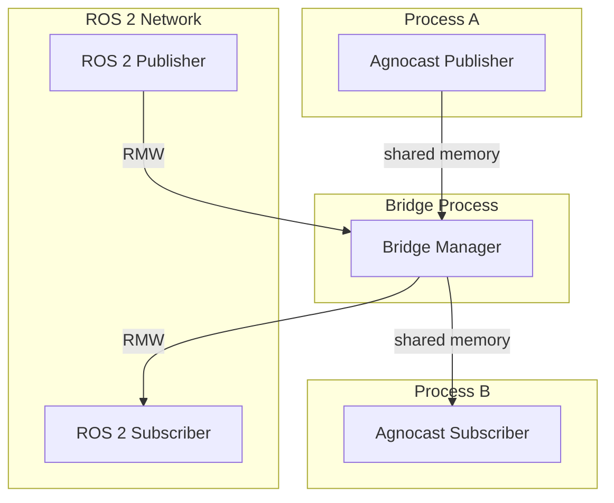

# Agnocast-ROS 2 Bridge

The Bridge enables communication between Agnocast nodes and standard ROS 2 nodes (RMW). It automatically forwards messages bidirectionally, allowing gradual migration — you don't need to migrate all nodes at once.
Message circulation (echo-back) is automatically prevented by the Bridge's internal logic; no additional configuration or constraints are required.
The Bridge can be introduced at **either Stage 1 or Stage 2**. It is independent of which node class you use.

!!! note
    Native Agnocast pub/sub is limited to a single ECU and a single IPC namespace. The Bridge connects Agnocast nodes to ROS 2 (RMW) nodes within the same ECU; it does not provide native Agnocast transport across ECUs or across IPC namespaces. See [Limitations](../index.md#limitations) for the full list.


```mermaid
graph LR
    subgraph Agnocast World
        A[Agnocast Publisher]
        B[Agnocast Subscriber]
    end
    subgraph Bridge
        BR[Bridge Manager]
    end
    subgraph ROS 2 World
        C[ROS 2 Publisher]
        D[ROS 2 Subscriber]
    end
    A -->|shared memory| BR
    BR -->|RMW| D
    C -->|RMW| BR
    BR -->|shared memory| B
```

For example, on a given topic, one side can be an Agnocast publisher while the other is a ROS 2 subscriber, or vice versa — the Bridge transparently connects them:


```mermaid
graph LR
    subgraph "/camera/image"
        P1[Agnocast Publisher] --> BR1[Bridge] --> S1[ROS 2 Subscriber]
    end
    subgraph "/lidar/points"
        P2[ROS 2 Publisher] --> BR2[Bridge] --> S2[Agnocast Subscriber]
    end
```

## Bridge Modes

The Bridge is enabled by default, so the system continues to work as-is even when individual publishers or subscribers are migrated to Agnocast — no additional setup is required.
Agnocast supports the following bridge modes, controlled by the `AGNOCAST_BRIDGE_MODE` environment variable:

| Mode | Value | Description |
|------|-------|-------------|
| **Off** | `0` or `off` | Bridge disabled. Agnocast and ROS 2 nodes cannot communicate. |
| **On** | `on` | Single bridge manager process per IPC namespace. **Default mode.** |

Values are case-insensitive. If an unknown value is given, the Bridge falls back to `on` with a warning. `1` / `standard` and `2` / `performance` are accepted for backward compatibility but are deprecated aliases for `on`.

## Configuration

### Setting the Bridge Mode

**In launch files (XML):**

```xml
<node pkg="your_package" exec="your_node" name="your_node" output="screen">
    <env name="LD_PRELOAD" value="libagnocast_heaphook.so:$(env LD_PRELOAD '')" />
    <env name="AGNOCAST_BRIDGE_MODE" value="on" />
</node>
```

**As an environment variable:**

```bash
export AGNOCAST_BRIDGE_MODE=on  # or "off"
```

### Disabling the Bridge

If all your nodes use Agnocast and you don't need RMW interoperability:

```xml
<env name="AGNOCAST_BRIDGE_MODE" value="off" />
```

## Bridge Architecture

The Bridge uses a single bridge manager process per IPC namespace. A bridge for a topic is created **lazily** — only when both an Agnocast endpoint and an external ROS 2 endpoint exist for that topic — and destroyed when either endpoint disappears.


```mermaid
graph TD
    subgraph Process A
        PA[Agnocast Publisher]
    end
    subgraph Process B
        SB[Agnocast Subscriber]
    end
    subgraph Bridge Process
        BM[Bridge Manager]
    end
    subgraph ROS 2 Network
        R1[ROS 2 Publisher]
        R2[ROS 2 Subscriber]
    end
    PA -->|shared memory| BM
    BM -->|RMW| R2
    R1 -->|RMW| BM
    BM -->|shared memory| SB
```

### Bridge Plugins (Optional)

The Bridge works out of the box — message types are resolved at runtime. For higher throughput, you can optionally provide pre-compiled bridge plugins via the `agnocast_bridge_plugins` package. When a plugin is available for a given message type, the Bridge uses it; otherwise, it falls back to runtime resolution automatically.

**Step 1:** Generate bridge plugins for the message types you need:

```bash
ros2 agnocast generate-bridge-plugins \
  --message-types std_msgs/msg/String sensor_msgs/msg/Image geometry_msgs/msg/Pose

# Service types use --service-types
ros2 agnocast generate-bridge-plugins \
  --service-types example_interfaces/srv/AddTwoInts

# Or for all available message/service types
ros2 agnocast generate-bridge-plugins --all
```

Specify interface types with their fully-qualified names (e.g., `std_msgs/msg/String`).
At least one of `--message-types`, `--service-types`, or `--all` is required.
Use `--output-dir` to choose where the package is generated (default: `./agnocast_bridge_plugins`):

```bash
ros2 agnocast generate-bridge-plugins --all --output-dir ~/my_ws/src/agnocast_bridge_plugins
```

**Step 2:** Build the plugins:

```bash
colcon build --packages-select agnocast_bridge_plugins
```

!!! note
    If you add new custom message types later, regenerate and rebuild the plugins. To search additional plugin directories, set [`AGNOCAST_BRIDGE_PLUGINS_PATH`](../api/environment-variables.md#agnocast_bridge_plugins_path).

For Agnocast-wide limitations (memory layout requirements, single-ECU scope, domain isolation), see [Limitations](../index.md#limitations).

## QoS Behavior

The Bridge's QoS behavior differs by direction:

**ROS 2 → Agnocast (R2A):**
The Bridge's internal ROS 2 subscription inherits the QoS settings from the external Agnocast subscriber. The Bridge's internal Agnocast publisher uses fixed QoS:

- Depth: 10
- Durability: TransientLocal

!!! warning
    Because the internal ROS 2 subscription inherits the external Agnocast subscriber's QoS, avoid a QoS mismatch on the ROS 2 side — specifically, a **Volatile publisher vs. Transient Local subscriber** combination, which prevents the connection.

**Agnocast → ROS 2 (A2R):**
The Bridge's internal ROS 2 publisher uses fixed QoS:

- Depth: 10
- Reliability: Reliable
- Durability: TransientLocal
