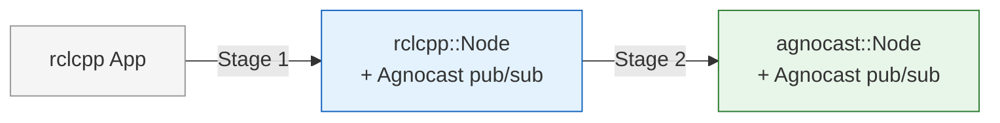

# Migration Guide

Existing rclcpp applications can be migrated to Agnocast in **two stages**. Each stage delivers measurable performance improvements, and you can stop at Stage 1 if it meets your needs.

## Stage 1: Agnocast Pub/Sub

**Keep `rclcpp::Node`**, rewrite only publishers, subscriptions, and smart pointers.

- Node class remains `rclcpp::Node` — minimal code changes
- Publishers use `agnocast::create_publisher` (free function)
- Subscriptions use `agnocast::create_subscription` (free function)
- Callbacks receive `agnocast::ipc_shared_ptr<const MessageT>` instead of `MessageT::SharedPtr`
- Messages are allocated via `borrow_loaned_message()` for true zero-copy
- Executors must be switched to Agnocast-aware executors

**What you gain:** True zero-copy IPC for all Agnocast topics.

[Stage 1 details and code examples →](stage1.md)

## Stage 2: agnocast::Node

**Replace the node class** with `agnocast::Node`.

- Can only be introduced once **all** publishers and subscriptions in the node are Agnocast-ized
- `agnocast::Node` bypasses the rcl layer entirely — no RMW participant is created
- Publishers and subscriptions are created via member functions (`this->create_publisher(...)`) instead of free functions
- Initialization uses `agnocast::init()` instead of `rclcpp::init()`
- Executors use `agnocast::AgnocastOnly*Executor` variants

**What you gain:** Reduced launch time, lower CPU usage, and elimination of the RMW overhead.

[Stage 2 details and code examples →](stage2.md)

## Bridge

The **Agnocast-ROS 2 Bridge** enables communication between Agnocast nodes and standard ROS 2 nodes. The Bridge can be introduced at **either Stage 1 or Stage 2** — it is independent of the migration stage.

This is essential for gradual migration, where some nodes use Agnocast while others still use RMW.

[Bridge documentation →](bridge.md)

## Quick Reference: What Changes at Each Stage

| Aspect | Original (rclcpp) | Stage 1 | Stage 2 |
|--------|-------------------|---------|---------|
| Node base class | `rclcpp::Node` | `rclcpp::Node` | `agnocast::Node` |
| Include | `rclcpp/rclcpp.hpp` | + `agnocast/agnocast.hpp` | `agnocast/agnocast.hpp` |
| Publisher creation | `create_publisher<T>(...)` | `agnocast::create_publisher<T>(this, ...)` | `this->create_publisher<T>(...)` |
| Subscription creation | `create_subscription<T>(...)` | `agnocast::create_subscription<T>(this, ...)` | `this->create_subscription<T>(...)` |
| Callback argument | `T::SharedPtr` | `agnocast::ipc_shared_ptr<const T>` | `agnocast::ipc_shared_ptr<const T>` |
| Publish pattern | `publisher->publish(msg)` | `borrow_loaned_message()` → `publish(move)` | `borrow_loaned_message()` → `publish(move)` |
| Initialization | `rclcpp::init()` | `rclcpp::init()` | `agnocast::init()` |
| Executor | `rclcpp::executors::*` | `agnocast::*AgnocastExecutor` | `agnocast::AgnocastOnly*Executor` |
| LD_PRELOAD | Not required | Required | Required |
| CMake dependency | `rclcpp` | `agnocastlib` | `agnocastlib` |
